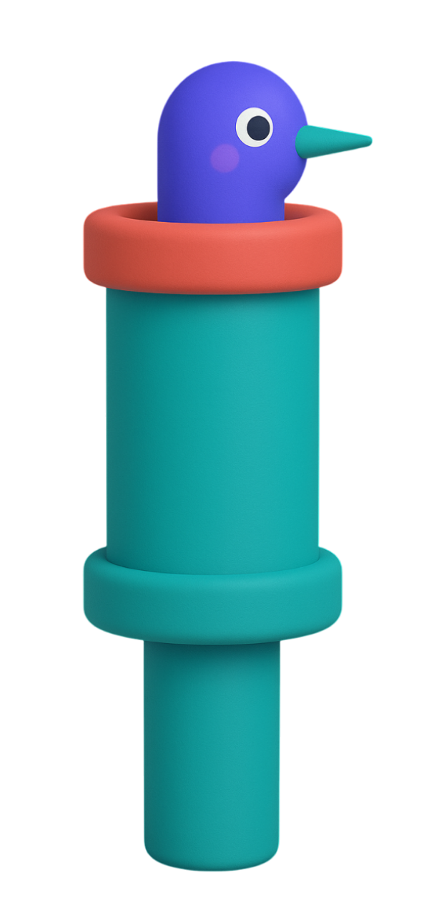

<p align="center">
  
</p>

<h1 align="center">Piper</h1>

<p align="center">
  <strong>Flutter state management, simplified.</strong><br>
  ViewModels with automatic lifecycle. Just Dart.
</p>

<p align="center">
  <a href="https://pub.dev/packages/piper_state"></a>
  <a href="https://pub.dev/packages/piper_state/score"></a>
  <a href="https://pub.dev/packages/piper_state/score"></a>
  <a href="https://github.com/theGlenn/piper/actions/workflows/ci.yml"></a>
  <a href="https://codecov.io/gh/theGlenn/piper"></a>
  <a href="https://opensource.org/licenses/MIT"></a>
  <a href="https://flutter.dev"></a>
</p>

---

- ✅ **Automatic cleanup** — streams cancel, tasks abort on dispose
- ✅ **Explicit dependencies** — constructor injection, no magic
- ✅ **Zero boilerplate** — no code generation required
- ✅ **Testable** — plain Dart classes

## Quick Start
```dart
class CounterViewModel extends ViewModel {
  late final count = state(0);

  void increment() => count.update((c) => c + 1);
}
```
```dart
class CounterPage extends StatelessWidget {
  @override
  Widget build(BuildContext context) {
    final vm = context.vm<CounterViewModel>();

    return Scaffold(
      body: Center(
        child: vm.count.build((count) => Text('$count')),
      ),
      floatingActionButton: FloatingActionButton(
        onPressed: vm.increment,
        child: Icon(Icons.add),
      ),
    );
  }
}
```

## Stream Binding

Subscriptions auto-cancel on dispose:
```dart
class AuthViewModel extends ViewModel {
  final AuthRepository _auth;

  AuthViewModel(this._auth);

  late final user = bind(_auth.userStream, initial: null);
}
```

## Async Operations

Loading, error, and data states handled automatically:
```dart
late final profile = asyncState<Profile>();

void load() => load(profile, () => _repo.fetchProfile());
```
```dart
vm.profile.build(
(state) => switch (state) {
AsyncData(:final data) => Text(data.name),
AsyncError(:final message) => Text('Error: $message'),
_ => CircularProgressIndicator(),
},
);
```

## Installation
```yaml
dependencies:
  piper_state: ^0.0.3
  flutter_piper: ^0.0.3
```

## Documentation

📖 **[Full Documentation](https://theglenn.github.io/piper)**

## Packages

| Package | pub.dev |
|---------|---------|
| [piper_state](packages/piper) | [](https://pub.dev/packages/piper_state) |
| [flutter_piper](packages/flutter_piper) | [](https://pub.dev/packages/flutter_piper) |

## License

MIT