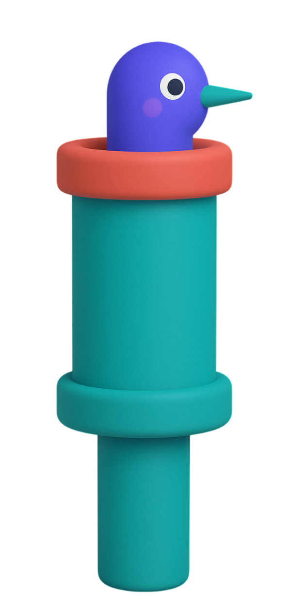

<p align="center">
  
</p>

<h1 align="center">Piper State</h1>

<p align="center">
  <strong>Flutter state management that cleans up after itself.</strong><br>
  Plain Dart ViewModels with automatic rebuilds, stream cleanup, and cooperative task cancellation.
</p>

<p align="center">
  <a href="https://pub.dev/packages/piper_state"></a>
  <a href="https://pub.dev/packages/piper_state/score"></a>
  <a href="https://pub.dev/packages/piper_state/score"></a>
  <a href="https://glennso.dev/piper/"></a>
  <a href="https://github.com/theGlenn/piper/actions/workflows/ci.yml"></a>
  <a href="https://codecov.io/gh/theGlenn/piper"></a>
  <a href="https://opensource.org/licenses/MIT"></a>
  <a href="https://flutter.dev"></a>
</p>

---

Piper gives every piece of state an owner. Put state, derived values, streams,
and async tasks in a plain Dart ViewModel; when it disposes, Piper cleans up
the work it started.

- ✅ **Automatic rebuilds** — `Watch` subscribes to the state it reads
- ✅ **Lifecycle-owned cleanup** — streams and cooperative tasks stop on dispose
- ✅ **Explicit dependencies** — constructor injection keeps the graph visible
- ✅ **Plain Dart** — no code generation, direct unit tests

## Quick Start
```dart
class CounterViewModel extends ViewModel {
  late final count = state(0);

  void increment() => count.update((c) => c + 1);
}
```
```dart
class CounterPage extends StatelessWidget {
  @override
  Widget build(BuildContext context) {
    final vm = context.vm<CounterViewModel>();

    return Scaffold(
      body: Center(
        child: vm.count.build((count) => Text('$count')),
      ),
      floatingActionButton: FloatingActionButton(
        onPressed: vm.increment,
        child: Icon(Icons.add),
      ),
    );
  }
}
```

## Stream Binding

Subscriptions auto-cancel on dispose:
```dart
class AuthViewModel extends ViewModel {
  final AuthRepository _auth;

  AuthViewModel(this._auth);

  late final user = bind(_auth.userStream, initial: null);
}
```

## Async Operations

Loading, error, and data states handled automatically:
```dart
late final profile = asyncState<Profile>();

void loadProfile() => load(profile, () => _repo.fetchProfile());
```
```dart
vm.profile.build(
(state) => switch (state) {
AsyncData(:final data) => Text(data.name),
AsyncError(:final message) => Text('Error: $message'),
_ => CircularProgressIndicator(),
},
);
```

## Cancellation

Search-as-you-type, without RxDart and without stale results:
```dart
class SearchViewModel extends ViewModel {
  SearchViewModel(this._repo);
  final SearchRepository _repo;

  late final results = asyncState<List<Result>>();
  Task<void>? _search;

  void onQueryChanged(String query) {
    _search?.cancel();               // drop the in-flight search
    if (query.isEmpty) {
      results.setEmpty();
      return;
    }

    results.setLoading();
    _search = launch((cancellation) async {
      // debounce
      await cancellation.wait(Future<void>.delayed(Duration(milliseconds: 300)));
      final data = await cancellation.wait(_repo.search(query));
      results.setData(data);         // unreachable if cancelled
    });
  }
}
```

Awaiting through `cancellation.wait` unwinds the task body at the next
suspension point, so a slow `"f"` can never overwrite a fast `"flutter"`. No
`mounted` checks, no request sequence numbers. Navigating away disposes the
ViewModel and cancels the task with it.

## Reactive Rebuilds

`Watch` rebuilds from whatever state you read inside it — one widget, many
values, no dependency lists:
```dart
Watch((context) => vm.loading.value
    ? const CircularProgressIndicator()
    : Text(vm.name.value))
```

`computed` derives state that recomputes only when its dependencies change:
```dart
class TodosViewModel extends ViewModel {
  late final todos = bindAsync<List<Todo>>(repo.todosStream);

  late final pending = computed(
    () => todos.value.dataOrNull?.where((t) => !t.done).toList() ?? const [],
    equals: (a, b) => listEquals(a, b),
  );
}
```

## How It Compares

|  | Piper | Riverpod | Bloc |
|---|---|---|---|
| Dependencies | constructor | `ref.watch` / `ref.read` | constructor |
| State changes | methods | providers + notifiers | methods (Cubit) or events → handlers (Bloc) |
| Classes per feature | 1 ViewModel | provider + notifier | 1 Cubit, or event + state + bloc |
| Code generation | none | optional | optional |
| Cancelling async work | `launch` + `cancellation.wait` | `ref.onDispose` + abort API | `bloc_concurrency` `restartable()` |
| Testing | plain Dart `test()` | `ProviderContainer.test()` | `blocTest` |

None of the three abort the underlying network call on their own — each unwinds
your code at an `await` boundary and leaves the socket to an abort API you wire
up. What differs is how much machinery sits between you and correct ordering.

Piper trades Riverpod's provider graph and Bloc's event log for plain objects
you can construct in a test with `new`. If you want the graph or the log, take
those instead — [full comparison →](https://glennso.dev/piper/guide/comparison)

## Installation

For Flutter apps, install `flutter_piper`; it re-exports the core
`piper_state` API:

```yaml
dependencies:
  flutter_piper: ^0.1.0
```

Pure Dart projects can install `piper_state: ^0.1.0` directly.

## Documentation

📖 **[Full Documentation](https://glennso.dev/piper/)** — guides, examples, and API reference.

New here? Start with [Getting Started](https://glennso.dev/piper/guide/getting-started),
then the [Search example](https://glennso.dev/piper/examples/search) for the
cancellation story above.

Want the visual version? [Try the live Piper Search Race demo](https://glennso.dev/piper/demo/)
to watch a slow search response overwrite fresh results — then watch Piper
cancel it first. The source lives in
[packages/flutter_piper/example](packages/flutter_piper/example/).

## Packages

| Package | pub.dev |
|---------|---------|
| [piper_state](packages/piper) | [](https://pub.dev/packages/piper_state) |
| [flutter_piper](packages/flutter_piper) | [](https://pub.dev/packages/flutter_piper) |

## Contributing

Issues and PRs welcome — bug reports and "this API felt awkward" feedback are
equally useful at this stage. See [CONTRIBUTING.md](CONTRIBUTING.md) for the
local workflow and pull-request checklist.

If Piper made a screen easier to reason about, a ⭐ helps other Flutter devs
find it.

## License

MIT
